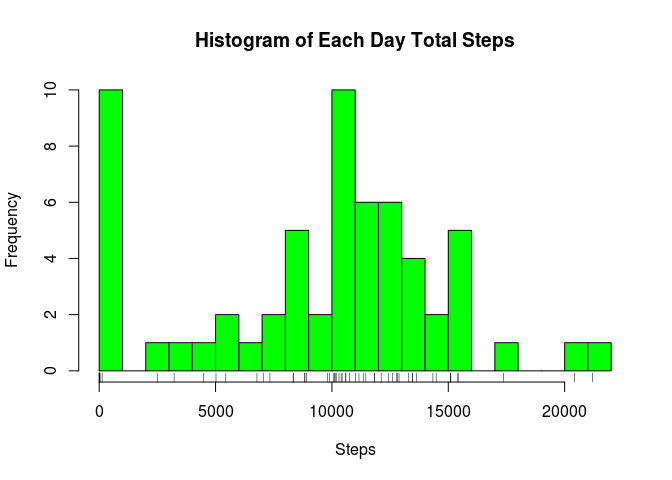
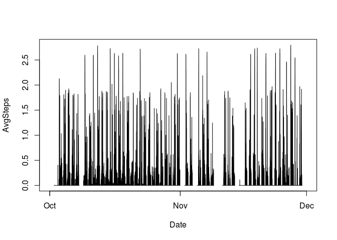
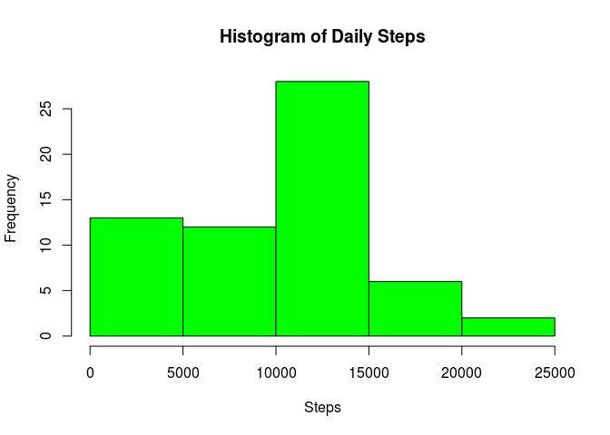
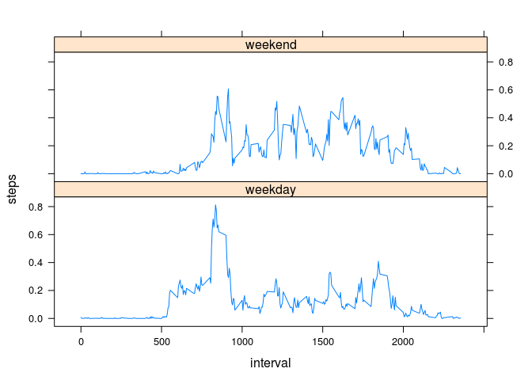

## Loading and preprocessing the data


```r
# url <- "https://d396qusza40orc.cloudfront.net/repdata%2Fdata%2Factivity.zip"
# download.file(url, destfile="activity.zip", method = "curl")
unzip("activity.zip")
activity <- read.csv("activity.csv")
```


## What is mean total number of steps taken per day?


Make a histogram of the total number of steps taken each day:

```r
totalsteps <- with(activity, tapply(steps, date, sum, na.rm=T))
tdates <- as.Date(rownames(totalsteps), "%Y-%m-%d")
tsteps <- as.numeric(totalsteps)
tdata <- data.frame(Date=tdates, Steps=tsteps)
hist(tdata$Steps, xlab = "Steps", breaks = 30, col = "green", main = "Histogram of Each Day Total Steps")
rug(tdata$Steps)
```

<!-- -->

Calculate and report the mean and median of the total number of steps taken per day:

```r
actable <- activity[complete.cases(activity), ]
stepsmedian <- stepsmedian <- as.numeric(tapply(actable$steps, actable$date, median))
stepsmean <- as.numeric(tapply(actable$steps, actable$date, mean))
data.frame(Date=tdates, Median=stepsmedian, Mean=stepsmean)
```

```
##          Date Median       Mean
## 1  2012-10-01     NA         NA
## 2  2012-10-02      0  0.4375000
## 3  2012-10-03      0 39.4166667
## 4  2012-10-04      0 42.0694444
## 5  2012-10-05      0 46.1597222
## 6  2012-10-06      0 53.5416667
## 7  2012-10-07      0 38.2465278
## 8  2012-10-08     NA         NA
## 9  2012-10-09      0 44.4826389
## 10 2012-10-10      0 34.3750000
## 11 2012-10-11      0 35.7777778
## 12 2012-10-12      0 60.3541667
## 13 2012-10-13      0 43.1458333
## 14 2012-10-14      0 52.4236111
## 15 2012-10-15      0 35.2048611
## 16 2012-10-16      0 52.3750000
## 17 2012-10-17      0 46.7083333
## 18 2012-10-18      0 34.9166667
## 19 2012-10-19      0 41.0729167
## 20 2012-10-20      0 36.0937500
## 21 2012-10-21      0 30.6284722
## 22 2012-10-22      0 46.7361111
## 23 2012-10-23      0 30.9652778
## 24 2012-10-24      0 29.0104167
## 25 2012-10-25      0  8.6527778
## 26 2012-10-26      0 23.5347222
## 27 2012-10-27      0 35.1354167
## 28 2012-10-28      0 39.7847222
## 29 2012-10-29      0 17.4236111
## 30 2012-10-30      0 34.0937500
## 31 2012-10-31      0 53.5208333
## 32 2012-11-01     NA         NA
## 33 2012-11-02      0 36.8055556
## 34 2012-11-03      0 36.7048611
## 35 2012-11-04     NA         NA
## 36 2012-11-05      0 36.2465278
## 37 2012-11-06      0 28.9375000
## 38 2012-11-07      0 44.7326389
## 39 2012-11-08      0 11.1770833
## 40 2012-11-09     NA         NA
## 41 2012-11-10     NA         NA
## 42 2012-11-11      0 43.7777778
## 43 2012-11-12      0 37.3784722
## 44 2012-11-13      0 25.4722222
## 45 2012-11-14     NA         NA
## 46 2012-11-15      0  0.1423611
## 47 2012-11-16      0 18.8923611
## 48 2012-11-17      0 49.7881944
## 49 2012-11-18      0 52.4652778
## 50 2012-11-19      0 30.6979167
## 51 2012-11-20      0 15.5277778
## 52 2012-11-21      0 44.3993056
## 53 2012-11-22      0 70.9270833
## 54 2012-11-23      0 73.5902778
## 55 2012-11-24      0 50.2708333
## 56 2012-11-25      0 41.0902778
## 57 2012-11-26      0 38.7569444
## 58 2012-11-27      0 47.3819444
## 59 2012-11-28      0 35.3576389
## 60 2012-11-29      0 24.4687500
## 61 2012-11-30     NA         NA
```


## What is the average daily activity pattern?


Make a time series plot (i.e. type = "l") of the 5-minute interval (x-axis) and the average number of steps taken, averaged across all days (y-axis):

```r
library(dplyr)
```

```
## 
## Attaching package: 'dplyr'
```

```
## The following objects are masked from 'package:stats':
## 
##     filter, lag
```

```
## The following objects are masked from 'package:base':
## 
##     intersect, setdiff, setequal, union
```

```r
activity$date <- as.Date(as.character(activity$date), "%Y-%m-%d")

#Format to a 24hrs 5mins interval
activity1 <- activity
activity1$interval <- rep(seq(0, 1435, by = 5), 61)
dates <- paste(activity1$date, activity1$interval, sep = ".")

#Function addinterval used to use date and interval to  transform to a new time variable as "%Y-%m-%d %H:%M%:%S"
addinterval <- function(x){
    splitime = strsplit(x , '\\.')
    sdate <- as.POSIXlt(as.character(splitime[[1]][1]), "%Y-%m-%d")
    sdate$min <- sdate$min + as.numeric(splitime[[1]][2])
    sdate
}
test <- lapply(dates, addinterval)

# Compromise solution variable datecol declaration to store the new time variable
datecol <- test[[1]][1]
len <- length(test)
	for (i in seq_len(len)) {
		datecol[i] <- test[[i]][1]
	}
stepcol <- activity1$steps
newtable <- data.frame(Date=datecol, Steps=stepcol)

sumsteps <- newtable %>% group_by(Date) %>% summarise_at(c("Steps"), sum)
names(sumsteps) <- c("Date", "SumSteps")
newtable1 <- merge(newtable, sumsteps, by = "Date")

# Don't understand the sentense "the average number of steps taken, averaged across all days(I treated it as each interval steps divided each day 288 times 5 minutes interval)"
newtable2 <- newtable1 %>% mutate(AvgSteps=Steps/288)
with(newtable2, plot(Date, AvgSteps, type = "l"))
```

<!-- -->


Which 5-minute interval, on average across all the days in the dataset, contains the maximum number of steps?

```r
activity1[which.max(activity1$steps), ]
```

```
##       steps       date interval
## 16492   806 2012-11-27      375
```

```r
activity1[which.max(activity1$steps), ]$date
```

```
## [1] "2012-11-27"
```

```r
activity1[which.max(activity1$steps), ]$interval
```

```
## [1] 375
```


## Imputing missing values


Calculate and report the total number of missing values in the dataset (i.e. the total number of rows with NAs):

```r
sum(is.na(activity$steps), is.na(activity$date), is.na(activity$interval))
```

```
## [1] 2304
```


Devise a strategy for filling in all of the missing values in the dataset. The strategy does not need to be sophisticated. For example, you could use the mean/median for that day, or the mean for that 5-minute interval, etc.
Create a new dataset that is equal to the original dataset but with the missing data filled in.

```r
# Since all those dates below steps are all 'NA', I will set those NA to 0
unique(activity[is.na(activity$steps), ]$date)
```

```
## [1] "2012-10-01" "2012-10-08" "2012-11-01" "2012-11-04" "2012-11-09"
## [6] "2012-11-10" "2012-11-14" "2012-11-30"
```

```r
sum(is.na(activity[activity$date %in% unique(activity[is.na(activity$steps), ]$date), 1]))
```

```
## [1] 2304
```

```r
2304/length(unique(activity[is.na(activity$steps), ]$date))
```

```
## [1] 288
```

```r
tapply(activity[activity$date %in% unique(activity[is.na(activity$steps), ]$date), ]$steps, activity[activity$date %in% unique(activity[is.na(activity$steps), ]$date), ]$date, length)
```

```
## 2012-10-01 2012-10-08 2012-11-01 2012-11-04 2012-11-09 2012-11-10 
##        288        288        288        288        288        288 
## 2012-11-14 2012-11-30 
##        288        288
```

```r
# Zeroing all the NA in new dataset activity2 table
activity2 <- activity
activity2[activity2$date %in% unique(activity2[is.na(activity2$steps), ]$date) ,]$steps <- rep(0, sum(is.na(activity[activity$date %in% unique(activity[is.na(activity$steps), ]$date), 1])))
```


Make a histogram of the total number of steps taken each day

```r
hist(as.numeric(tapply(activity2$steps, activity2$date, sum)), col = "green", xlab = "Steps", main = "Histogram of Daily Steps")
```

<!-- -->


Calculate and report the mean and median total number of steps taken per day. 

```r
activity2mean <- as.numeric(tapply(activity2$steps, activity2$date, mean))
activity2median <- as.numeric(tapply(activity2$steps, activity2$date, median))
activity2date <- unique(activity2$date)
activity2table <- data.frame(Date=activity2date, StepsMedian=activity2median, StepsMean=activity2mean)
activity2table
```

```
##          Date StepsMedian  StepsMean
## 1  2012-10-01           0  0.0000000
## 2  2012-10-02           0  0.4375000
## 3  2012-10-03           0 39.4166667
## 4  2012-10-04           0 42.0694444
## 5  2012-10-05           0 46.1597222
## 6  2012-10-06           0 53.5416667
## 7  2012-10-07           0 38.2465278
## 8  2012-10-08           0  0.0000000
## 9  2012-10-09           0 44.4826389
## 10 2012-10-10           0 34.3750000
## 11 2012-10-11           0 35.7777778
## 12 2012-10-12           0 60.3541667
## 13 2012-10-13           0 43.1458333
## 14 2012-10-14           0 52.4236111
## 15 2012-10-15           0 35.2048611
## 16 2012-10-16           0 52.3750000
## 17 2012-10-17           0 46.7083333
## 18 2012-10-18           0 34.9166667
## 19 2012-10-19           0 41.0729167
## 20 2012-10-20           0 36.0937500
## 21 2012-10-21           0 30.6284722
## 22 2012-10-22           0 46.7361111
## 23 2012-10-23           0 30.9652778
## 24 2012-10-24           0 29.0104167
## 25 2012-10-25           0  8.6527778
## 26 2012-10-26           0 23.5347222
## 27 2012-10-27           0 35.1354167
## 28 2012-10-28           0 39.7847222
## 29 2012-10-29           0 17.4236111
## 30 2012-10-30           0 34.0937500
## 31 2012-10-31           0 53.5208333
## 32 2012-11-01           0  0.0000000
## 33 2012-11-02           0 36.8055556
## 34 2012-11-03           0 36.7048611
## 35 2012-11-04           0  0.0000000
## 36 2012-11-05           0 36.2465278
## 37 2012-11-06           0 28.9375000
## 38 2012-11-07           0 44.7326389
## 39 2012-11-08           0 11.1770833
## 40 2012-11-09           0  0.0000000
## 41 2012-11-10           0  0.0000000
## 42 2012-11-11           0 43.7777778
## 43 2012-11-12           0 37.3784722
## 44 2012-11-13           0 25.4722222
## 45 2012-11-14           0  0.0000000
## 46 2012-11-15           0  0.1423611
## 47 2012-11-16           0 18.8923611
## 48 2012-11-17           0 49.7881944
## 49 2012-11-18           0 52.4652778
## 50 2012-11-19           0 30.6979167
## 51 2012-11-20           0 15.5277778
## 52 2012-11-21           0 44.3993056
## 53 2012-11-22           0 70.9270833
## 54 2012-11-23           0 73.5902778
## 55 2012-11-24           0 50.2708333
## 56 2012-11-25           0 41.0902778
## 57 2012-11-26           0 38.7569444
## 58 2012-11-27           0 47.3819444
## 59 2012-11-28           0 35.3576389
## 60 2012-11-29           0 24.4687500
## 61 2012-11-30           0  0.0000000
```


Do these values differ from the estimates from the first part of the assignment? What is the impact of imputing missing data on the estimates of the total daily number of steps?

```r
###Do these values differ from the estimates from the first part of the assignment?
###No, since those NA covers all that days, according my calculation or formula it won't impact it at all.
###What is the impact of imputing missing data on the estimates of the total daily number of steps?
###If the calculation treated each day interval as denominator, of course it will lower the original average steps.
```


## Are there differences in activity patterns between weekdays and weekends?


Create a new factor variable in the dataset with two levels – “weekday” and “weekend” indicating whether a given date is a weekday or weekend day.

```r
# Convert date variable to the day of week
days <- sapply(lapply(activity$date, weekdays),function(x){x[1]})

# Convert day of week to factor variable weekday or weekend
weekorweekend <- as.character(sapply(days, function(x){ if (x %in% c("Monday","Tuesday","Wednesday","Thursday","Friday")) {"weekday"} else {"weekend"} }))

# Append the new factor variable to activity
activity3 <- activity
activity3$day <- as.factor(weekorweekend)
```


Make a panel plot containing a time series plot (i.e. type = "l") of the 5-minute interval (x-axis) and the average number of steps taken, averaged across all weekday days or weekend days (y-axis).

```r
# Split into two tables based on factor variable day
weekdaytable <- split(activity3, activity3$day)$weekday
weekendtable <- split(activity3, activity3$day)$weekend

# Form columns for new table
weekdaymean <- as.numeric(with(weekdaytable[!is.na(weekdaytable$steps), ], tapply(steps, interval, mean)))/288
weekendmean <- as.numeric(with(weekendtable[!is.na(weekendtable$steps), ], tapply(steps, interval, mean)))/288
interval <- unique(weekdaytable$interval)
weekdaystr <- rep("weekday", 288)
weekendstr <- rep("weekend", 288)

reneweekdaytable  <- data.frame(interval=interval, steps=weekdaymean, day=weekdaystr)
reneweekendtable  <- data.frame(interval=interval, steps=weekendmean, day=weekendstr)
fulltable <- rbind(reneweekdaytable, reneweekendtable)

# Sigh, final plot use lattice
library(lattice)
xyplot(steps ~ interval | day, data = fulltable, layout=c(1,2), type="l")
```

<!-- -->


